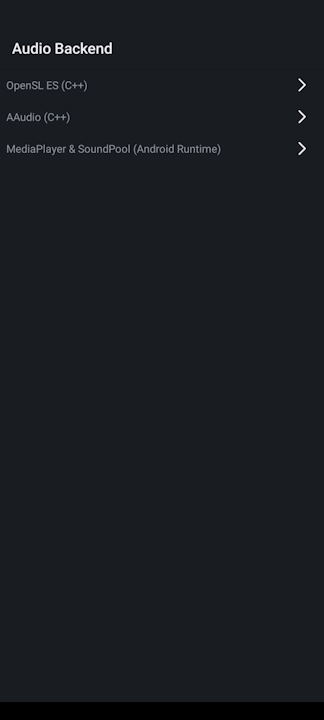
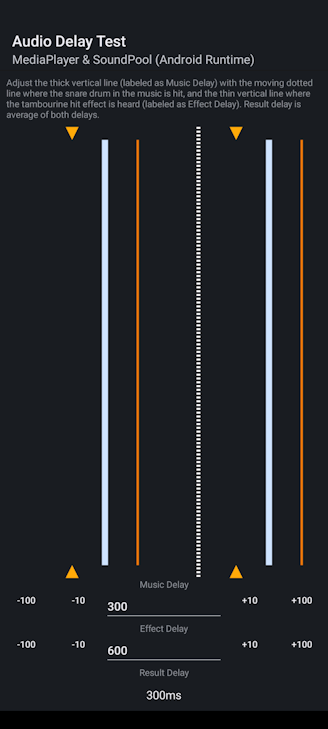
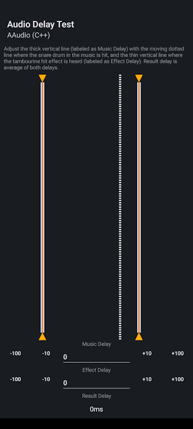

#   Audio Delay Tester
A simple app to test audio delay on an Android Device on each Audio Backend API :
- MediaPlayer & SoundPool Combo (Android Runtime, Java / Kotlin)
- AAudio (C++)
- OpenSL ES (C++)

## Screenshots




## Features
Not much, just most basic feature:
- Visual offset adjustment for measuring
- Each audio backend has it's own testing
- Release APK is Less than 1MB
> This project did not use any library other than what's already available in Android SDK and NDK. not even compat library or test framework
- Supports Android TV

## System Requirements
- Android 9.0 Pie (API 28) - Should theoritically be able to go even lower
- Mono Audio Output (or better)
- 10MB Free Storage
- 32MB Free RAM
- CPU that is either of : ARMv7, ARM64-v8a, x86 and x86_64
- 480x854 Screen
> Never tested on lower screen resolution, should be fine until 240x320

## How to Use
- Download the APK from Release Page
- Install on your desired Device
- Select Desired Backend To Test
- Hear the Sound and adjust the visualized delay line based on what you hear

## Building
### Prerequisites
- Android Studio with:
    - Android SDK Platform v34 or newer
    - Android NDK 26.0.xxxx or newer

### Steps
- Clone the repo
```shell
git clone https://github.com/EmiyaSyahriel/AudioDelayTester
```
- Open the repo in Android Studio
- Wait for the project configuration and index building steps
- Connect your device via USB or Wirelessly for Debugging
- Press the Play Button on top right-hand
- Now the app will launch on your device

If you just want an APK instead of running on your device :
- For Normal APK 
    - On Menu, run `Build > Build Bundle(s) / APK(s) > Build APK(s)`
    - An apk will be automatically generated and a notification will appear, click the `locate` link to open where the APK is generated
    
- For Signed APK 
    - On Menu, run `Build > Generate Signed Bundle / APK`
    - Type : APK
    - Select your keystore file and enter your keystore credential there.
    - Choose the build type you want to build and where the APK will be build, and then click `Create`
    - When the build process finished, you can find the APK in `(Your Build Destination Folder)/(buildtype)/ndkaudiotest-(buildtype).apk` (e.g `/media/user01/builds/release/ndkaudiotest-release.apk`)

## Why I made this?
<details>
<summary>Just read the TL;DR! </summary>
My phone, Nokia X30 5G is actually suffers from audio delay on games but not on normal media players like YouTube or MX Player, therefore I'd like to investigate what's happening, All games I've tested so far is Unity games, which by default uses their old modified FMOD unless the developer integrates other middleware. And the implication is that Unity's version of FMOD is only using OpenSL ES as it's backend.
</details>

I made this app to test how long is the audio delay in this Nokia X30 5G for each backend, the result is:
| Nokia X30 5G | `OpenSL ES` | `AAudio` | `MediaPlayer` |
| ---------    | ---------   | ---      | ------        |
| Music Delay  |  600ms      | 520ms    | 0ms           |
| Effect Delay |  1100ms     | 1100ms   | 20ms          |
| Final Result |  550ms      | 550ms    | 0ms           |

<details>
<summary>Just another useless testimonial </summary>
Therefore, If anyone notices when I'm sharing my ミリシタ gameplay on YouTube that is recorded on My Nokia X30 5G and notice that most of the notes is out of sync, That is actually a device issue guys, please believe me! Well, I still have my Nokia T20 here which have perfect audio sync, just the spec is not very high to allow for good 3D rendering on games.
</details>

## License 
MIT License (see [LICENSE](LICENSE))